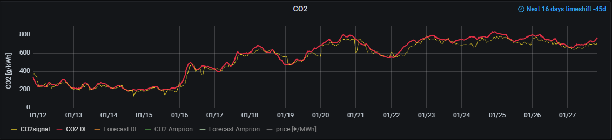
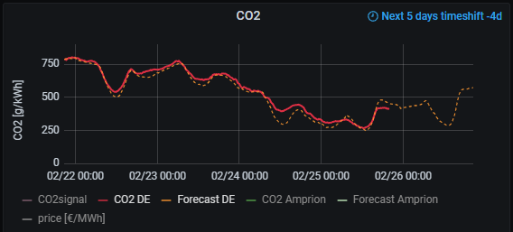
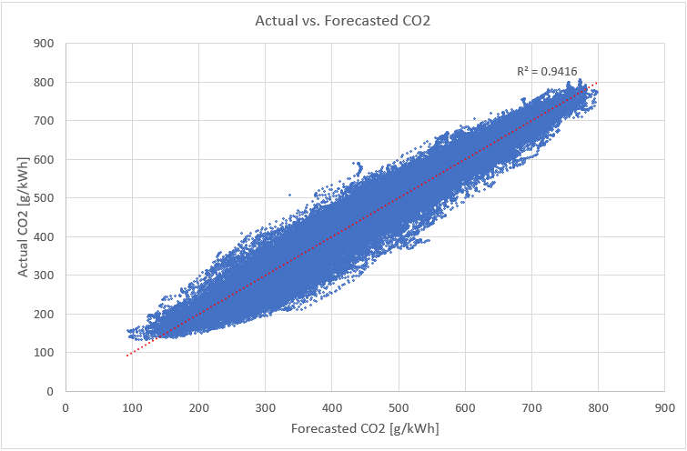
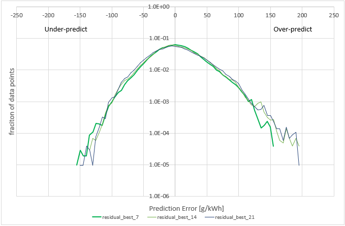
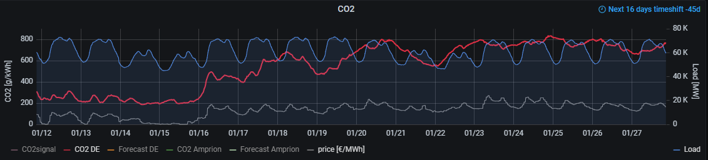
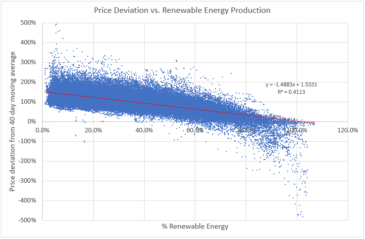
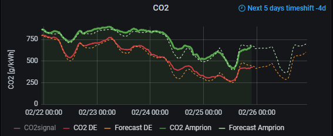

---
title: CO2 Intensity
layout: template
order: 3
filename: CO2Intensity
--- 

# CO2 Intensity Forecast

Forecast the CO2 footprint of grid power and time heavy consumers to periods with lots of renewable energy

----------- 
## Table of Content

  - [What problem are we trying to solve?](#what-problem-are-we-trying-to-solve)
  - [Under the hood - how do we get there?](#under-the-hood---how-do-we-get-there)
    - [CO2 intensity calculations](#co2-intensity-calculations)
    - [Load and auction price](#load-and-auction-price)
  - [Supported Countries and Regions](#supported-countries-and-regions)
  - [Sanitizing data for a zone](#sanitizing-data-for-a-zone)
    - [Control Regions vs. Country](#control-regions-vs-country)
    - [Sanitizing CO2 Intensity Data](#sanitizing-co2-intensity-data)
    - [Sanitizing the forward looking fit for CO2 forecast](#sanitizing-the-forward-looking-fit-for-co2-forecast)
  - [A possible strategy to use this data](#a-possible-strategy-to-use-this-data)
  - [Further references](#further-references)

<small><i><a href='http://ecotrust-canada.github.io/markdown-toc/'>Table of contents generated with markdown-toc</a></i></small>


-----------

## What problem are we trying to solve?

We install PV rooftop systems to have our own, green energy. We may even add a battery, to extend the sunshine into the night. We may charge electric vehicles and run heat pumps from this. Great!

But then comes winter, cloudy days and weeks ... and all we have is dirty old grid power. So we drive our electric vehicles with coal? Really? There is an inspiring start-up [Electricity Maps](https://app.electricitymaps.com/map), who tries to bring reason to this madness. It starts with understanding the CO2 intensity of grid electricity, which they calculate for many countries and areas. They also have some excellent thinking in their _blog_ section.

Ideas which are discussed there and elsewhere:
* Can we do [load shifting](https://www.electricitymaps.com/blog/carbon-savings-load-shifting) - beyond just switching on the dish-washer in the sunny hours of a hot summer day? What if we would charge our EVs when the CO2 foot-print of grid power was low - also in winter? That would be when have lots of wind energy?
* But does it help? Or is any electricity consumption in moments where grids are less than 100% supplied by renewable energies anyway creating a marginal carbon footprint determined by carbon fuels? - In the short run, maybe yes, but in the long run, it is [postulated](https://www.electricitymaps.com/blog/marginal-vs-average-real-time-decision-making) that smart energy consumption incentives the development of renewables.
* Risk of electrifying all our traffic is less that we don't have enough electricity in total, but that we overload the grid if we all drive to work and plug-in at 8:30. And all drive back home and plug in at 18:00 again.
* There are offerings such as [JEDLIX](https://www.jedlix.com/evdrivers), which remote-control EV charging, based on data from grid operators - and even pay back some cents/kWh to their users. But we trade this against control of the decision making process. (You do keep control when your car is expected to be fully charged)
* Flexible tariffs, such as [awattar](https://www.awattar.de/) try to incentify smart electricity usage. 

Bottom line - we'd like to look at data for insight. This section tries to help on that:
* _Electricity Maps_ provides [CO2signal](README#co2signal-configuration), but that's not forward looking, hence, not actionalbe.
* The [Transparency Platform](https://transparency.entsoe.eu/) provides deep insight into the European state of the power grid (and is one of the main sources for _Electricity Maps_).
* what data would we like to have?
  + CO2 intensity of the (local) power grid
  + total grid load - if the load is very high, we might be reluctant to consume off-shore wind energy from the North Sea in southern Germany
  + auction prices on electricity markets - prices tend to be low, when there are lots of (cheap) renewables in the grid
  
These are the kind of questions we want to answer with the [Entso-E forecast provider](README#entso-e-configuration) in _PVForecast_.

## Under the hood - how do we get there?

The ugly first: The _Entro-E Transparency Platform_ only covers the European grid. So, so we are limited to this region. But in Europe, we are fine ... Technically, we can run on about 63 countries and regions listed. But extensive validation has only been done for Germany. (Users are encouraged to publish other validation results in the [Github discussion](https://github.com/StefaE/PVForecast/discussions) section).

### CO2 intensity calculations

The [Electricity Maps Wiki](https://github.com/electricitymaps/electricitymaps-contrib/wiki) describes in detail the methodology of CO2 footprint calculations and emission factors per power source and region. The [Transparency Platform _Actual Generation per Production Type_](https://transparency.entsoe.eu/generation/r2/actualGenerationPerProductionType/show) provides actual data on energy consumption. So, all we need is to multiply emission factors with energy produced, and we get a CO2 footprint.

The following shows the CO2 intensity for Germany in January 2023: Red is as calculated in _PVForecast_, and yellow is provided from _Electricity Maps_ [CO2signal](https://www.co2signal.com/). We can see that we have a pretty good match between the 'gold standard' _CO2signal_ and the calculations performed by _PVForecast_.


	
Next, we need to forecast CO2 intensity. Luckily, the _Transparency Platform_ provides [Generation Forecasts for Wind and Solar](https://transparency.entsoe.eu/generation/r2/dayAheadGenerationForecastWindAndSolar/show) as well as [overall Generation Forecasts](https://transparency.entsoe.eu/generation/r2/dayAheadAggregatedGeneration/show). These forecasts are provided at 18:00 Brussels time for the day ahead and at 8:00 Brussels for the current day. This can be used to calculate a percentage of _non-renewable_ energy as 
<p style="text-align:center">1 - renewableGeneration/totalGeneration</p>

It turns out that this percentage correlates very well with the CO2 footprint generated: The solid line corresponds to the actual CO2 intensity as explained above, whereas the dotted line is the forecasted footprint at the time of writing this article. It appears that tomorrow is a sunny day across Germany with lots of solar energy at noon, causing a welcome dip in CO2 pollution.


	
Whilst we see, that on a short period of a few days, the said percentage and the CO2 footprint correlate well, this cannot be assumed for a long period (eg. years): Grid properties change, power plants go in maintenance, gas/coal mix changes, nuclear retires, etc. Hence, the correlation needs constant re-tuning: correlation coefficients are continuously calculated based on the last few days of actual vs. forecasted data. The resulting overall prediction is then stable over a long period, below for 2020 - 2022 (each dot corresponds to a 15min interval)


	
The number of days to establish the correlation should not be too short (noise reduction), but also not too long (as it won't be responsive to changes of grid properties). It was found that 7 days are an optimum, but could be extended to ~21 days without much loss in accuracy. The following shows forecast errors for three different regression intervals (7, 14 and 21 days):


	
The correlation period can be adapted with `modelDays` in the config file, defaulting to 7 days.
	
### Load and auction price

[Load forecasts](https://transparency.entsoe.eu/load-domain/r2/totalLoadR2/show) and [Auction Prices](https://transparency.entsoe.eu/transmission-domain/r2/dayAheadPrices/show) are readily available on the _Transparency Platform_



It is obvious that load is lower over night and on weekends. Hence, everything else the same, big consumers should focus on night hours for the most grid-friendly behavior - ie., in order to not overload the grid. As can already be seen, market prices (gray line) correlate somewhat with the CO2 footprint. That's not too surprising, as renewable energies are the cheapest today. 

To illustrate this further, we can look at the below graph: for every hour of the time frame 2020 - 2022, the deviation of the market price to the 40-day moving average is plotted in y. On x we plot the percentage of renewable energies:


	
The use of a deviation from a 40-day moving average filters out the impact of the energy crises on prices, due to the war: average prices increased from 40Eur/MWh in 2020 to more than 600Eur/MWh in Autumn 2022 and then started dropping agin. After filtering these longer-term effects, a correlation with the renewable energy percentage becomes visible. With >60% renewables, electricity prices can even drop into the negative, as they then start competing with sources which cannot be switched on and off fast enough, resulting in an oversupply.

## Supported Countries and Regions

The [CO2signal](README#co2signal-configuration) is available for the countries and regions shown on the [Electricity Maps map](https://app.electricitymaps.com/map). Unfortunatly, the free API does not provide forward looking data.

The _Transparency Platform_ has data on Europe. We interface to it with [entsoe-py](README#co2signal-configuration) which lists 63 countries and control regions. But not all of these regions support all data types. [EntsoE_Zones.pdf](EntsoE_Zones.pdf) shows a snapshot of what was available in late December 2022:
* the orange columns list which data types were available, and with what time interval
* the green columns show what can be (and is) calculated with _PVForecast_:
	+ %Generation is what we have been discussing above. _FULL_ means both _DayAhead_ and _IntraDay_ forecasts (at 18:00 and 08:00 Brussels respectively) are available
	+ CO2 indicates if we have sufficient data to calculate an actual CO2 footprint
	+ If we have both _%Generation_ and _CO2_ we can perform a CO2 forecast as explained.
	+ Auction prices are available for some zones. For DE and LU zones, _PVForecast_ automatically focuses on the bidding zone DE_LU for price information. DE_LU _and_ AT provide hourly and quarter hourly auction prices. Both are accessible; default is hourly, but with `resolution = 15T` quarter hourly prices can be accessed.
	+ %Load is a similar calculation as %Generation, but on the load side: 1 - renewableGeneration/total**Load**
	
The [Entso-E](README#entso-e-configuration) module calculates following columns (if corresponding data is available):

Colum Name | Column
-----------|--------
co2        | CO2 intensity, calculated from generated actual (g/kWh])
co2_forecast (*)      | forecasted CO2 intensity forecast, based on the most recent forecast (_DayAhead_ or _Intraday_)
pctGenerated_DayAhead | 1 - renewableGeneration/totalGeneration, based on DayAhead forecast
pctGenerated_Intraday | _same_, but based on Intraday forecast for renewables
pctLoad_DayAhead      | 1 - renewableGeneration/totalLoad, based on DayAhead forecast
pctLoad_Intraday      | _same_, but based on Intraday forecast for renewables
price                 | bidding prices (in Eur/MWh)

(*) if the Python library _scipy_ is not [installed](README#installation), this is the most recent pctGenerated_xxx figure. It will give the correct trend (ie., low is good, high not so much), but not absolute numbers.

## Sanitizing data for a zone

Technically, this should all run - otherwise we have a bug in the code and raise an [Issue](https://github.com/StefaE/PVForecast/issues). But it's a different question whether the data makes sense. Substantial sanitizing has been done for Germany, but not for other countries and control regions.

### Control Regions vs. Country

Germany is subdivided into four [control regions](https://www.smard.de/page/en/wiki-article/6138/205642). Bidding prices are identical and combined with LU in the zone DE_LU. But generation and load data are available separately. It may then not surprise very much that _Amprion_ has consistently a higher CO2 footprint than Germany as a total: The region doesn't border to the sea, hence has no off-shore wind power. But it does have the huge coal power plants of Garzweiler. Green shows CO2 footprint for the _Amprion_ region, red for DE:


	
We assume that data from the _Transparency Platform_ is accurate. However:
* the calculations used here only consider production data - hence are agnostic to impact of electricity import and export
* Some zones made _Electricity Maps_ consider [zone specific models ](https://github.com/electricitymaps/electricitymaps-contrib/wiki/Estimation-methods). It can be assumed that there are good reasons for this, and hence a modeling solely relying on the _Transparency Platform_ maybe mis-guided.

Hence, if we venture in zones outside Germany, we need sanitize the data.

### Sanitizing CO2 Intensity Data

This can be done in two steps:

1. compare production and consumption CO2 intensity on [Electricity Maps App](https://app.electricitymaps.com/map) for a while - are there huge differences? Likely, for small countries impact of import/export will be bigger than for large countries. Here we work only with production data - does this achieve the desired goal?

2. run [CO2signal](README#co2signal-configuration) and [Entso-E](README#entso-e-configuration) in parallel for a while and compare columns `co2signal_<zone>.carbonIntensity` and `entsoe_<zone>.co2`: Are the differences tolerable? 
	
Comparisons for Germany shows that _CO2signal_ sometimes is off for a few hours, but never for long. This is because they calculate CO2 hourly, but don't correct backwards. Hence, in case grid operators deliver data delayed we won't see this corrected in the free API. _PVForecast_ on the other hand always updates with a backward looking time window of 24h. The `SQLite` storage model could be used to check when corrections were made, since it stores data of each download separately.

### Sanitizing the forward looking fit for CO2 forecast

We could let _PVForecast_ run for a while to see how well the fit is going to work for other zones, other than DE and related. This is kind of boring. However, the _Transparency Portal_ allows to download up to one year worth of data. We can do this as follows:

```
[Entso-E]
    api_key   = <api_from_Entso-E>
    zones     = DE                   # comma separated list of zones to be analyzedDE  #, FR
    keepRaw   = 1                    # keep all downloaded raw data columns
    start     = 2023-01-01T23:00Z
    end       = 2023-02-18T23:00Z
    loop      = 0
    storeCSV  = 1
```

This will `storeCSV` all data (including all columns downloaded, due to `keepRaw = 1`) between `start` and `end`. This can then be analyzed in Excel.
Note that the generated table also contains `co2_forecast`. However, this number does _not_ use rolling correlation coefficients of the respective last few days.

Once we have sanitized the proper working of the forecast model, we can backload the database - for the last week, month or year. To do this, we set `loop = 1` and let it run: It will download each day separately, calculate the rolling correlation coefficients and store the result in the database. This option doesn't make sense if not at least one of `storeInflux` or `storeDB` is enabled. `storeCSV` is disabled for looping.

## A possible strategy to use this data

Based on data described here, and in the [PV Output Power Forecast](PVOutput), an energy use strategy with the following priorities might make sense (not considering any financial aspects)

1. Conserve energy as much as possible - there is no such thing as _free_ solar energy; through grid feed-in somebody else might benefit
2. Noon peeks on sunny days: most likely, there is a surplus of renewable energies during these times, so running hot water preparation during this period is a good idea
3. Energy created locally - be it directly from PV system or stored in home battery: This limits load on the grid and is essentially CO2 free
4. Use energy when local control region has low CO2 foot-print - plan EV charging during such times, if not possible from own rooftop PV
5. Charge EV during night hours, when grid load is low - preferably during times when also country-wide CO2 foot-print is low

## Further references

* [Energy Charts](https://www.energy-charts.info/index.html?l=en&c=ALL) by Frauenhofer Institute for Solar Energy Systems ISE
* [SMARD Strommarktdaten](https://www.smard.de/page/en/wiki-article/6138/205642) for the German electricity market