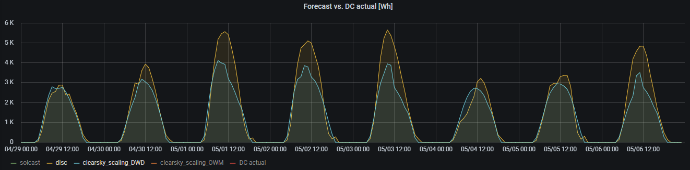
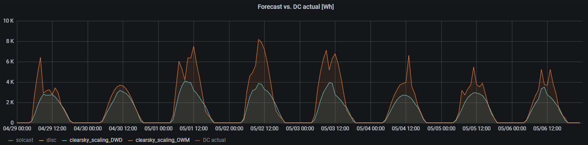

---
title: PV Output
layout: template
order: 2
filename: PVOutput
--- 

# PV Output Power Forecast
Forecast energy production of rooftop PV (photo-voltaic) installations for the coming hours and days
 
----------- 
## Table of Content

  - [Forecast Providers and Rough Comparison](#forecast-providers-and-rough-comparison)
    - [Solcast](#solcast)
    - [Traditional weather services](#traditional-weather-services)
    - [Forecast horizon](#forecast-horizon)
    - [Quantifying forecast quality](#quantifying-forecast-quality)

-----------

## Forecast Providers and Rough Comparison

### Solcast

[Solcast](https://solcast.com/) is specializing on worldwide PV performance forecasts, based on satellite imaging. They offer forecasts for rooftop installations free-of-charge for up to dual-array configurations.

The following shows forecast and actual data for a week in early May 2021:

For comparison reasons, also _MOSMIX_ is shown in red. It seems obvious that _SolCast_ does a much better job in modeling the actual ups and downs of output power over the day. This is because they update their forecast every 15min ([region dependent](https://solcast.com/live-and-forecast)) and in the graph the most recent update is shown.

_SolCast_ is also the only source which provides a confidence interval (percentiles p10, p90) for its forecasts. We should hence expect fluctuations of actual generated power roughly within this interval.

### Traditional weather services

PV performance forecast can be done with help from traditional weather services such as [VisualCrossing](https://www.visualcrossing.com/), [Deutscher Wetterdienst](https://www.dwd.de/DE/leistungen/met_verfahren_mosmix/) and [OpenWeatherMap.org](https://openweathermap.org/)) 

They may provide solar radiation data (_GHI_) or just cloud coverage data. Both can be used to generate a PV power forecast. The following picture shows the result - for a particularly bad day, April 29, 2021:

For this to work, we first need have radiation data (_GHI_) - preferably as provided by _VisualCrossing_ or _Deutscher Wetterdienst, DWD (MOSMIX)_. In case this is not available, we can fall back to cloud coverage data and estimate _GHI_ from that. 

Next, _GHI_ (global horizontal irradiation, the solar power (in W) falling on a flat surface of 1m2) is decomposed into _DNI_ (direct normal radiation - the part of energy falling on the same surface due to direct illumination by the sun) and _DHI_ (diffuse horizontal irradiation - the part of energy falling on the same surface due to diffuse illumination, eg. due to reflection in clouds, etc. (This diffuse illumination is of course the reason why it isn't pitch-black in shadows ...).

Various [irradiation models](README#convert-weather-data-to-irradiation-data) can be used to estimate _DNI_ from _GHI_, but `disc` is the most common one. _DHI_ then follows the fundamental geometrical equation `DNI = (GHI - DHI)/cos(Z)` where `Z` is the solar zenith angle (see eg. [Best Practices Handbook](https://www.nrel.gov/docs/fy15osti/63112.pdf)). 

The most common model to estimate _GHI_ from cloud coverage is `clearsky_scaling` which first calculates expected output power under clear sky conditions and then modulates this with cloud coverage. These forecasts are generally much less accurate than if a weather service directly delivers _GHI_: The weather service has considerably more insight into the nature of high/mid/low altitude cloud coverage than a simple scaling algorithm can provide.

This modelling is empowered by the extensive [pvlib](https://pvlib-python.readthedocs.io/en/stable/) library.

In the following picture, we use _GHI_ (`Rad1h` in their lingo) from DWD/MOSMIX and calculate PV output power with `disc`. As GHI data is not available for all stations, `clearsky_scaling` uses cloud coverage data from DWD/MOSMIX. Both are reasonably closely related to each other:

As with any weather forecast, different providers sometimes diverge. OpenWeatherMap only provides cloud coverage, so - for fairness - we should only compare this with cloud-based forecasts from DWD:

Hmm... what to believe? Forecasts are difficult, especially those about the future!

### Forecast horizon

For the example of _SolCast_, we'll investigate a bit how forecasts evolve over different forecast horizons. Solcast is updating its forecast every 15min (although forecast intervals are always fixed at 30min for the rooftop version). The maximum forecast horizon is 14 days.

Hence, if we look at eg. April 29th, we get the following picture. The concept described here is identical for other forecast providers, although forecast updates are much rarer (hourly, six-hourly)

Forecasts from the preceding days (April 23rd .. April 28th) were updated about once a day (greenish) and as accurate as other weather forecasts. However, on the current day (April 29th), forecasts are updated every 15min (blueish).

The red line indicates the latest (last) forecast for the respective 30min time period. 

Hence, for this particular day, long term forecasts from previous days were far too optimistic. Satellite based current day forecasts were quite stable in the morning, but trended to lower PV output in the afternoon.

Comparing these forecasts with actuals, show that on this exceptional day, Solcast was still overly optimistic between 8:00 and 12:00 and actuals were even outside the confidence interval of earlier forecasts.

Generally speaking, _SolCast_ and _VisualCrossing_ update their forecasts aggressively over time. _MOSMIX_ does not significantly change forecasts once issued. This is true for both versions of _MOSMIX_: the station specific three-hourly update (`MOSMIX_L`) as well as the 'all-stations' hourly update (`MOSMIX_S`).

### Quantifying forecast quality

The above discussion motivates a deeper look at forecast quality as a function of forecast horizon: Which forecast is most accurate for current day / next day / future days? Such data will eventually be published here, but it requires recording over an extended period in time.
